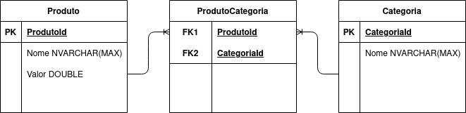

# Solução desafio back-end

### Autor

- Desenvolvedor: Uthant Vicentin
- Email: uthantvicentin@pm.me

#### Frameworks

- [C# .NET Core 3.1](https://docs.microsoft.com/pt-br/dotnet/)
- [Entity Framework Core 3.1](https://docs.microsoft.com/pt-br/ef/core/);
- [SQL Server](https://docs.microsoft.com/pt-br/sql/sql-server/?view=sql-server-ver15);
- [Docker](https://docs.docker.com/)
- [Swagger](https://swagger.io/)
- [Guia de estilos de código C#](https://docs.microsoft.com/pt-br/dotnet/csharp/programming-guide/inside-a-program/coding-conventions)


#### DER



#### Nota
A implementação foi iniciada utilizando o [Sqlite](https://sqlite.org/index.html). Todo o processo de migration, item obrigatório segundo as normas do desafio, estão disponibilizadas em commits anteriores:

[Exemplo migration](https://github.com/uthantvicentin/Backend-test/tree/1a2699981954fafee3f98d7b2954b64e32624526/BackEnd.Repository/Migrations)

A solução sofreu rebuild para utilização do [SQL Server](https://docs.microsoft.com/pt-br/sql/sql-server/?view=sql-server-ver15), portanto, os atuais migrations não estão conforme solicitado, mas o processo para análise, primeiro o produto depois a categoria, está disponibilizado no link anteriomente mencionado.

## Requisitos para executar a aplicação
 1. Docker
 2. Docker-compose

 [Link para download](https://www.docker.com/products/docker-desktop)

### Windows
 *O executavel para windows já contem as duas dependências*.

Certifique-se de instalar a atualização do kernel do Linux para Windows. 

https://docs.microsoft.com/pt-br/windows/wsl/install-win10#step-4---download-the-linux-kernel-update-package.

Caso tenha algum empecilho com a instalação, basta seguir o [Manual](https://docs.docker.com/docker-for-windows/install/).

### Linux

#### Debian Like (Ubuntu)
Instale o curl:
```
apt-get install curl -y
```
Baixe a ultima versão do docker:
```
curl -L https://github.com/docker/compose/releases/download/1.28.0/docker-compose-Linux-x86_64 -o /usr/bin/docker-compose
```
Dê permissão de administrador para o comando:
```
chmod +x /usr/bin/docker-compose
```

#### Arch
Baixe os pacotes do repositório geral:
```
pacman -S docker docker-compose
```

### Pós-instalação
***O Docker irá fazer uso portas 5000 e 1433.***

***Caso tenha algum servidor ativo com essas portas, desligue.***


Navegue até a raiz do projeto e execute:

***Execute no PowerShell (Windows).***
```
docker-compose up --force-recreate
```

A aplicação estará em execução após a seguinte mensagem:
```
backend-api_1    | info: Microsoft.Hosting.Lifetime[0]
backend-api_1    |       Now listening on: http://[::]:80
backend-api_1    | info: Microsoft.Hosting.Lifetime[0]
backend-api_1    |       Application started. Press Ctrl+C to shut down.
backend-api_1    | info: Microsoft.Hosting.Lifetime[0]
backend-api_1    |       Hosting environment: Production
backend-api_1    | info: Microsoft.Hosting.Lifetime[0]
backend-api_1    |       Content root path: /app
```
Caso o processo anterior termine com a mensagem:

```
backend-test_backend-api_1 exited with code 139
 
```
Faça rebuild do container:

```
docker-compose up --build
```
Com isso você deverá ver a mensagem alertando que a aplicação esta rodando.

API `http://localhost:5000/`

Documentação Swagger `http://localhost:5000/swagger/`
