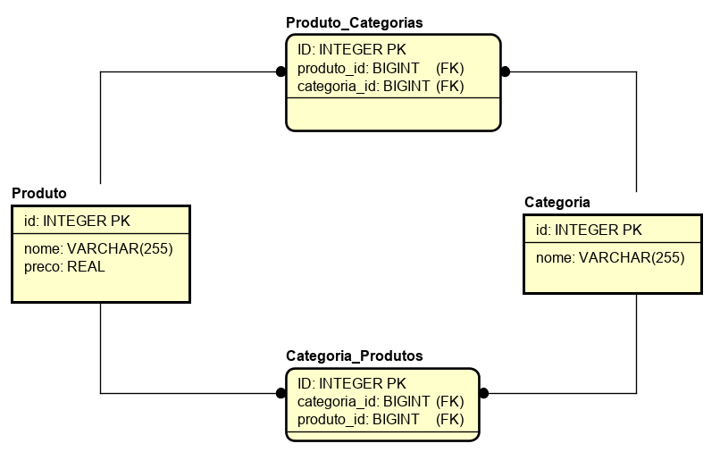

# API de Manipulação de Produtos e Categorias

### Autor

- Desenvolvedor: Deodato Silva
- Email: deodatojunior999@gmail.com

#### Frameworks

- [Python 3.9.5](https://www.python.org/doc/)
- [SQLite](https://sqlite.org/index.html)
- [Docker](https://docs.docker.com/)
- [Django 3.2.4](https://www.djangoproject.com)
- [Django Rest Framework 3.12.4](https://www.django-rest-framework.org)
- [Guia de estilo para código Python PEP8](https://www.python.org/dev/peps/pep-0008/)


#### Diagrama de Entidade-Relacionamento



#### Nota
Sendo o banco de dados utilizado SQLite, ele está localizado junto ao código Python.

Usei o Insomnia para testes de requisições API

- [Insomnia](https://insomnia.rest/download)

## Requisitos para executar a aplicação
 1. Docker
 2. Docker Compose

 [Link para download](https://www.docker.com/products/docker-desktop)

### Windows
 *O executavel para windows já contem as duas dependências*.

Certifique-se de instalar a atualização do kernel do Linux para Windows. 

https://docs.microsoft.com/pt-br/windows/wsl/install-win10#step-4---download-the-linux-kernel-update-package.

Caso tenha algum empecilho com a instalação, basta seguir o [Manual](https://docs.docker.com/docker-for-windows/install/).

### Linux

#### Ubuntu 20.04
Primeiro, atualize sua lista existente de pacotes:
```
sudo apt update
```
Em seguida, instale alguns pacotes pré-requisito que deixam o apt usar pacotes pelo HTTPS:
```
sudo apt install apt-transport-https ca-certificates curl software-properties-common

```
Então, adicione a chave GPG para o repositório oficial do Docker no seu sistema:
```
curl -fsSL https://download.docker.com/linux/ubuntu/gpg | sudo apt-key add -

```
Adicione o repositório do Docker às fontes do APT:
```
sudo add-apt-repository "deb [arch=amd64] https://download.docker.com/linux/ubuntu focal stable"

```

Em seguida, atualize o banco de dados do pacote com os pacotes do Docker do recém adicionado repositório:
```
sudo apt update

```
Certifique-se de que você está prestes a instalar do repositório do Docker ao invés do repositório padrão do Ubuntu:

```
apt-cache policy docker-ce
```

Finalmente, instale o Docker:

```
sudo apt install docker-ce

```

O Docker deve agora ser instalado, o daemon iniciado e o processo habilitado a iniciar no boot. Verifique se ele está funcionando:
```
sudo systemctl status docker
```

Agora, instale o Docker Compose:
```
sudo curl -L "https://github.com/docker/compose/releases/download/1.29.2/docker-compose-$(uname -s)-$(uname -m)" -o /usr/local/bin/docker-compose

```

Em seguida, defina as permissões corretas para que o comando docker-compose seja executável:
```
sudo chmod +x /usr/local/bin/docker-compose

```
Para verificar se a instalação foi bem sucedida, execute:
```
docker-compose --version
```

### Pós-instalação
***O Docker irá fazer uso da porta 80.***

***Caso tenha algum servidor ativo com essas portas, desligue.***


Navegue até a pasta TesteBackend e execute:

***Execute no PowerShell (Windows).***
```
docker-compose up --build
```

A aplicação estará em execução após a seguinte mensagem:
```
web_1  | Watching for file changes with StatReloader
web_1  | Performing system checks...
web_1  |
web_1  | System check identified no issues (0 silenced).
web_1  |
web_1  | You have 18 unapplied migration(s). Your project may not work properly until you apply the migrations for app(s): admin, auth, contenttypes, sessions.
web_1  | Run 'python manage.py migrate' to apply them.
web_1  | June 07, 2021 - 01:38:30
web_1  | Django version 3.2.4, using settings 'TesteBackend.settings'
web_1  | Starting development server at http://0.0.0.0:80/

```
Caso o processo anterior termine com a mensagem:

```
testebackend_web_1 exited with code 139
 
```
Faça rebuild do container:

```
docker-compose up --build
```
Com isso você deverá ver a mensagem alertando que a aplicação esta rodando.

API para testes de endpoints e Documentação de cada requisição informada na URL do navegador pelo Django Rest Framework `http://localhost/` ou `http://127.0.0.1/`


