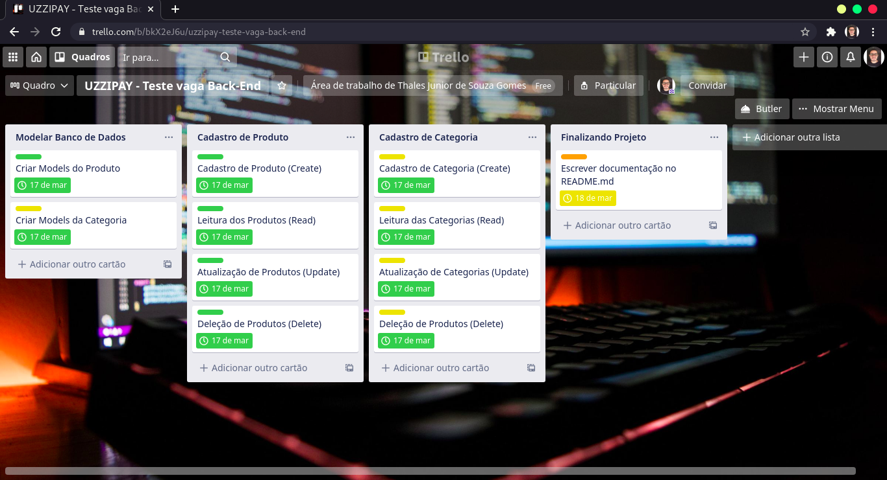
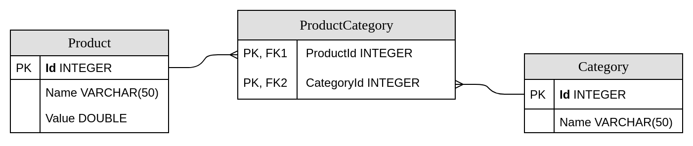

# API RESTful Backend-test

- Desenvolvedor: Thales Junior de Souza Gomes.
- Email: thales3238junior@gmail.com
- Linkedin: [Thales Gomes](https://www.linkedin.com/in/thales-junior-de-souza-gomes-8223ab175/)
#### Este projeto Utiliza:

- [C# .NET Core 3.1](https://docs.microsoft.com/pt-br/dotnet/)
- [Entity Framework Core 3.1](https://docs.microsoft.com/pt-br/ef/core/);
- [SQL Server](https://docs.microsoft.com/pt-br/sql/sql-server/?view=sql-server-ver15);
- [Docker](https://docs.docker.com/)
- [Guia de estilos de código C#](https://docs.microsoft.com/pt-br/dotnet/csharp/programming-guide/inside-a-program/coding-conventions)
### Descrição do Projeto
Desenvolvimento de uma RESTFul API para realização de CRUD de produtos e categorias. Atributos de produtos (Id, Name, Value) e atributos de categoria(Id, Name).

Foi utilizada a ferramenta online [Trello](https://trello.com/) para realizar o planejamento de entrega das tarefas, utilizando a metodologia Kanban.



#### Modelagem entidade-relacionamento

### Configuração do Ambiente
- Certifique - se que o .NET Core 3.1, Entity Framework Core 3.1 e o Docker estejam instalados;

#### Execute o Shell Script para configurar e iniciar a aplicação automaticamente
```
sudo chmod +x install.sh
source install.sh
```
#### Ou siga o passo a passo
Execute o comando para utilizar a image do SQL Server.
```
docker run -e "ACCEPT_EULA=Y" -e "SA_PASSWORD=Abcd1234*" -p 1433:1433 --name sql-server -d microsoft/mssql-server-linux:2017-latest
```
- A string de conexão com o SQL Server no docker (ConnectionStrings) fica localizada no arquivo appsettings.json dentro da pasta Publish;

- navege até a pasta Backend_test.Repository (Exemplo: ../Backend-test/Backend_test.Repository) e digite o comando para que o Entity Framework Core crie o banco de dados:
```
dotnet ef --startup-project ../Backend_test.API database update
```
- navege até a pasta Publish (Exemplo: ../Backend-test/Publish) e digite o comando para executar a aplicação:
```
dotnet Backend_test.API.dll
```

API deve funcionar no endereço `http://localhost:5000/`

